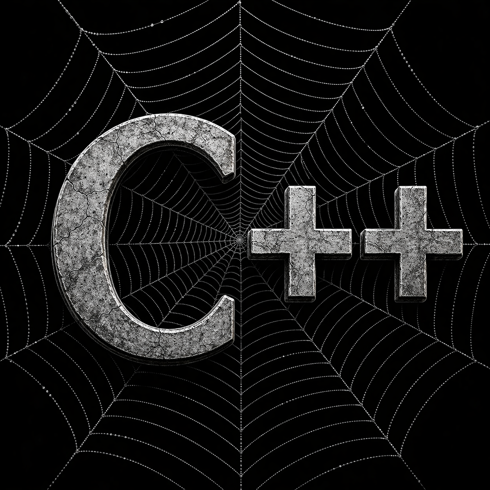

# MaiaCpp (WebCpp)
Maia C++ Compiler.



## Wrapper CLI

Use `bin/webcpp.sh` para gerar AST e artefatos de compilacao:

```bash
./bin/webcpp.sh --file ./compiler/test.cpp --all --out-dir ./out
```

Saidas suportadas:

- AST em XML (`--ast-xml-out`)
- AST em JSON (`--ast-json-out`)
- AST em arvore no terminal (`--ast-show`)
- C gerado (`--c-out`)
- WAT (`--wat-out`)
- WASM (`--wasm-out`)

Observacao:

- A geracao de WAT/WASM usa backend integrado do `cpp-compiler.js` (nao copia mais `runtime.wat`).

## Execucao do test.cpp (console, Node, browser)

Fluxo unificado (default: `compiler/test.cpp`):

```bash
bash ./bin/run-test-cpp.sh --target all
```

Alvos individuais:

```bash
# Console nativo (clang++/g++)
bash ./bin/run-test-console.sh ./compiler/test.cpp

# Node + WASM
bash ./bin/run-test-node.sh ./compiler/test.cpp

# Browser + WASM (inicia servidor local)
bash ./bin/run-wasm-browser.sh ./compiler/test.cpp
```

Runner no browser:

- `tools/browser/run-wasm.html`
- Aceita query `?wasm=/caminho/para/arquivo.wasm`

## Architecture

- See `docs/ARCHITECTURE.md` for an English architecture overview.
- See `docs/EBNF_IMPLEMENTATION_AUDIT.md` for a detailed gap definition against `grammar/Cpp.ebnf`.
- See `docs/CONFORMANCE_MATRIX.md` for implementation status by grammar family.
